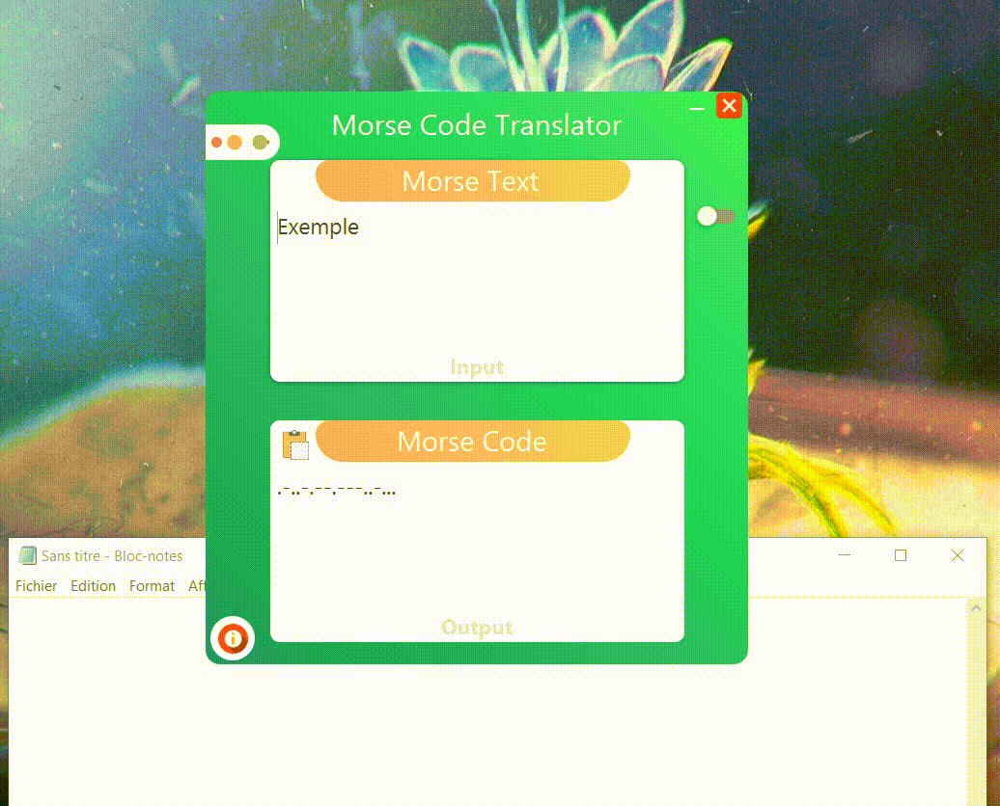
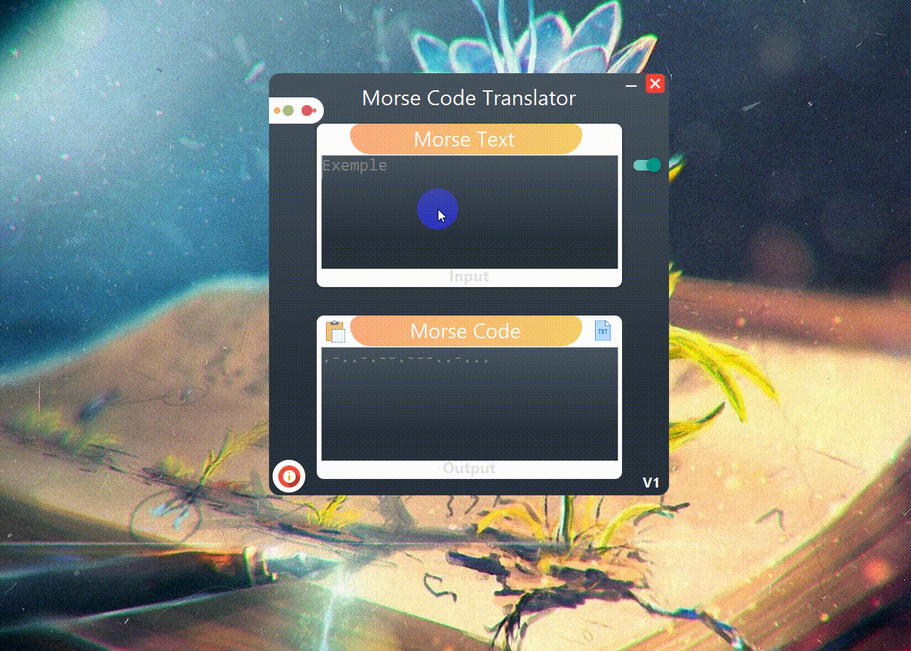

<h1 align="center">Morse Code Translator</h1>

Morse Code Translator is a translator that lets anyone translate text to Morse code  easily. With the Morse code translator, anyone can convert any plain text  to Morse code. 

## Screenshots    
Main App           | Save Result
:---------------------:|:------------------:
  | 

(<a href="#top">back to top</a>)

## Features
* [x] Copy The Output 
* [x] Switch Mode
* [x] Add Morse for (Punctuation)
* [ ] Add file txt (to Translate it)
* [x] Save The Output (in txt)

(<a href="#top">back to top</a>)

## Libraries 📚

| Library |
| ------ | 
| JFoenix |  
| AnimateFX | 
| controlsfx | 
| fontawesomefx |  
| TrayTester | 

(<a href="#top">back to top</a>)

## Contributing 💡
If you want to contribute to this project and make it better with new ideas, your pull request is very welcomed.😊😇

(<a href="#top">back to top</a>)

